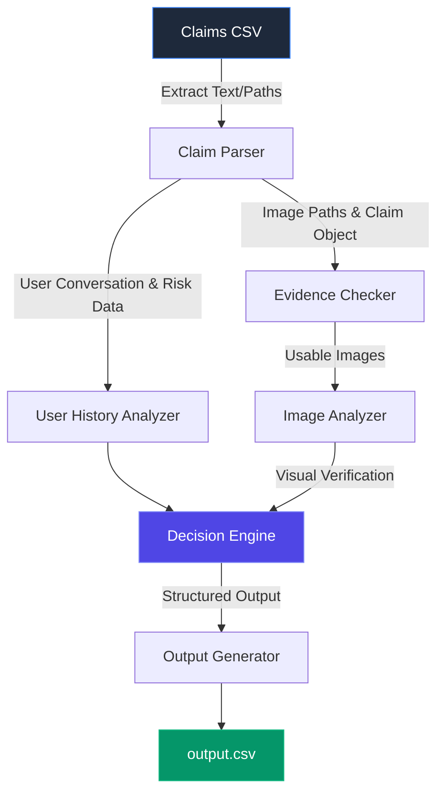

# ClaimVision

**AI-Powered Damage Claim Verification & Evidence Intelligence Platform**

---

## Overview

ClaimVision is a state-of-the-art multimodal evidence review system designed to streamline and automate the verification of damage claims. The platform intelligently analyzes multiple streams of information:

*   **Damage Images**
*   **User Claim Conversations**
*   **User History Context**
*   **Evidence Requirements**

By synthesizing these data points, ClaimVision autonomously determines whether a claim is:
*   🟢 **Supported**: The visual evidence clearly matches the user's claim.
*   🔴 **Contradicted**: The visual evidence directly contradicts the claim (e.g., claimed damage is visible as completely intact, or flags indicate fraudulent behavior).
*   ⚪ **Not Enough Information**: The visual evidence is missing, entirely obstructed, or lacks the necessary clarity to confidently make a decision.

---

## Problem Statement

Reviewing manual damage claims (for automobiles, electronics, packages, etc.) is traditionally a slow, labor-intensive process highly prone to human error and subjective bias. Evaluating the validity of a claim requires parsing conversational input, visually identifying structural issues in unstructured photos, and cross-referencing user risk profiles.

ClaimVision's objective is to fully automate this pipeline using multimodal AI capabilities. In our decision logic, **images are treated as the primary source of truth**. User history, conversational tone, and prior claim counts provide only contextual risk information and are never allowed to override clear visual evidence.

---

## Features

*   **Multimodal Image Analysis**: Deep vision analysis to identify specific structural damage such as dents, scratches, cracks, shattered glass, missing pieces, or packaging tears.
*   **Claim Extraction from Conversations**: Robust deterministic and AI-powered extraction logic to parse unstructured user interactions into structured identifiers (e.g., `issue_type` and `object_part`).
*   **Evidence Sufficiency Verification**: Validates whether the submitted images meet the minimum required standards (size, clarity, object inclusion) before rendering a decision.
*   **User Risk Assessment**: Synthesizes historical risk flags and conversational prompt injections to flag suspicious activity without hallucinating damage.
*   **Severity Estimation**: Automatically assigns a severity rating (Low, Medium, High) based on the combined output of claim extraction and visual validation.
*   **Structured Output Generation**: Transforms complex analysis into clean, predictable schema data (`output.csv`).
*   **Evaluation Framework**: Included tooling to benchmark pipeline accuracy, precision, and recall against ground-truth sample data.
*   **Premium Analytics Dashboard**: A sleek, modern Next.js frontend to visualize claim verdicts, risk flags, and systemic metrics.
*   **Automated Report Generation**: Generates comprehensive markdown evaluation reports on demand.

---

## System Architecture

The analysis pipeline processes data through a structured sequence of highly decoupled modules:



---

## Tech Stack

**Frontend:**
*   Next.js (App Router)
*   TypeScript
*   TailwindCSS
*   shadcn/ui
*   Framer Motion

**Backend:**
*   Python 3.10+
*   FastAPI (Dashboard API routing)
*   Pandas (Data processing and schema mapping)
*   Pydantic (Validation schemas)

**AI & Models:**
*   Google Gemini / OpenAI Vision Models (Multi-Modal verification)

**Utilities:**
*   Tenacity (Retry logic)
*   Diskcache (Response caching to minimize API costs)
*   Scikit-learn (Metric calculations)
*   TQDM (Progress tracking)

---

## Folder Structure

```text
ClaimVision/
├── AGENTS.md                   # Agent runtime and compliance rules
├── README.md                   # This documentation
├── output.csv                  # The structured pipeline results
├── code/                       # Backend Python Pipeline
│   ├── main.py                 # Core CLI entry point
│   ├── config.py               # Constants and environment configuration
│   ├── data_loader.py          # CSV ingestion and validation
│   ├── pipeline.py             # Orchestration of the analysis flow
│   ├── prompts.py              # System prompt and VLM prompt builder
│   ├── vlm_client.py           # API integration for AI vision
│   ├── deterministic_engine.py # Regex/Rule-based deterministic fallback logic
│   └── evaluation/             # Evaluation frameworks
│       ├── main.py             # CLI entry for running metric evaluation
│       ├── metrics.py          # Precision/Recall calculation logic
│       └── evaluation_report.md# Automatically generated performance metrics
├── dashboard/                  # Next.js Frontend Application
│   ├── src/                    # Frontend source code
│   │   ├── app/                # Next.js App Router (page.tsx, layout.tsx, globals.css)
│   │   └── components/         # Reusable UI components
│   ├── public/                 # Static frontend assets
│   ├── tailwind.config.ts      # Tailwind styling configuration
│   └── package.json            # Node dependencies
└── dataset/                    # Source data (claims, history, requirements)
    ├── claims.csv              
    ├── sample_claims.csv       
    ├── user_history.csv        
    ├── evidence_requirements.csv
    └── images/                 # Image assets for processing
```

---

## Installation

### 1. Clone Repository

```bash
git clone https://github.com/yukthivarma27-code/ClaimVision.git
cd ClaimVision
```

### 2. Backend Setup

It is highly recommended to use a virtual environment (`venv`).

```bash
python -m venv venv
source venv/bin/activate  # On Windows: venv\Scripts\activate
pip install -r requirements.txt
```

### 3. Environment Variables

To utilize the full capability of the vision models, configure your `.env` file at the root of the project with at least one supported API key:

```env
GEMINI_API_KEY=your_gemini_api_key
# OR
OPENAI_API_KEY=your_openai_api_key
```
*(Note: If no API key is provided, the backend gracefully falls back to the deterministic Regex/Rule-based engine).*

### 4. Run Prediction Pipeline

Execute the main backend analysis to process `dataset/claims.csv` and generate the `output.csv`.

```bash
python code/main.py
```

### 5. Run Evaluation

Benchmark the pipeline's accuracy against `dataset/sample_claims.csv`:

```bash
python code/evaluation/main.py
```

### 6. Run Frontend Dashboard

Spin up the ClaimVision Next.js dashboard to visually review the processed claims:

```bash
cd dashboard
npm install
npm run dev
```
Navigate to `http://localhost:3000` in your browser.

---

## Output Schema

The prediction pipeline explicitly generates an `output.csv` at the repository root. Every row in `output.csv` corresponds to a claim and maps to the following strict schema:

| Column Name | Type | Description |
| :--- | :--- | :--- |
| `user_id` | String | The unique identifier for the user submitting the claim. |
| `image_paths` | String | Semicolon-separated absolute/relative paths to the submitted evidence images. |
| `user_claim` | String | The original conversational text outlining the user's issue. |
| `claim_object` | String | The overarching object being claimed (e.g., `car`, `laptop`, `package`). |
| `evidence_standard_met` | Boolean | `true` if the submitted images meet the minimum required evidence standards, `false` otherwise. |
| `evidence_standard_met_reason` | String | Justification text explaining why the evidence standard was or was not met. |
| `risk_flags` | Enum | Semicolon-separated string of identified risk signals (e.g., `blurry_image;user_history_risk` or `none`). |
| `issue_type` | Enum | The specific nature of the damage (e.g., `dent`, `scratch`, `crack`, `glass_shatter`, `broken_part`, `none`, `unknown`). |
| `object_part` | Enum | The specific structural part of the object affected (e.g., `front_bumper`, `screen`, `seal`, `unknown`). |
| `claim_status` | Enum | The final decision algorithm output: `supported`, `contradicted`, or `not_enough_information`. |
| `claim_status_justification` | String | Explainable reasoning linking the visual evidence and conversation logic to the final `claim_status`. |
| `supporting_image_ids` | String | Semicolon-separated filenames (without extensions) of images confirming the claim, or `none`. |
| `valid_image` | Boolean | `true` if images are accessible and not corrupt; `false` otherwise. |
| `severity` | Enum | Severity rating mapping: `high`, `medium`, `low`, `none`, `unknown`. |

---

## Evaluation Metrics

ClaimVision utilizes a rigorous evaluation suite calculating the following standard classification metrics against expected labels:

*   **Accuracy**: The percentage of totally correct `claim_status` verdicts across the entire dataset.
*   **Precision**: The percentage of claims predicted as `supported` that were actually true positives (reducing false approvals).
*   **Recall**: The percentage of actual `supported` claims that the system correctly identified (reducing false rejections).
*   **F1 Score**: The harmonic mean of Precision and Recall, providing a singular score for system reliability.

---

## Dashboard

ClaimVision includes a premium enterprise-grade web dashboard crafted with Next.js and TailwindCSS. 

*   **Claims Review**: An interactive, dynamic list populated natively from `output.csv`.
*   **Image Viewer**: Direct preview capability for submitted multi-modal evidence.
*   **Risk Profiles**: Visual flagging using specialized badges (Emerald, Rose, Indigo palettes) for risk profiles (`manual_review_required`, `claim_mismatch`).
*   **Analytics & System Metrics**: High-level statistical tracking of pipeline throughput and current batch ratios.

---

## Sample Workflow

1.  **Ingestion**: System reads `dataset/claims.csv` containing raw conversations and image paths.
2.  **Analysis**: The pipeline orchestrates image accessibility verification, deterministic prompt parsing, and VLM multimodal evaluation.
3.  **Decision Engine**: Signals are correlated. Does the image support the conversation? Is there a prompt injection? Was the user history flagged for fraud?
4.  **Output**: System writes final standardized verdicts strictly adhering to the schema in `output.csv`.

---

## Future Improvements

*   **Fraud Detection Models**: Integration of specialized heuristic and anomaly-detection ML models beyond Vision Language matching.
*   **OCR Support**: Direct optical character recognition for extracting shipping labels and serial numbers natively.
*   **Explainable AI (XAI)**: Highlighted bounding boxes dynamically drawn onto source images showing *exactly* where the model detected the dent or crack.
*   **Real-time Claim Review**: WebSocket architecture enabling synchronous VLM verification while the user is actively submitting their claim.
*   **Enterprise Integrations**: Webhook delivery of the JSON schema to Salesforce, ServiceNow, or Zendesk instances.

---

## Author

Developed as a multimodal AI evidence review platform for automated damage claim verification. Designed specifically to adhere to high architectural constraints, absolute determinism in structured outputs, and enterprise-grade UI aesthetics.
