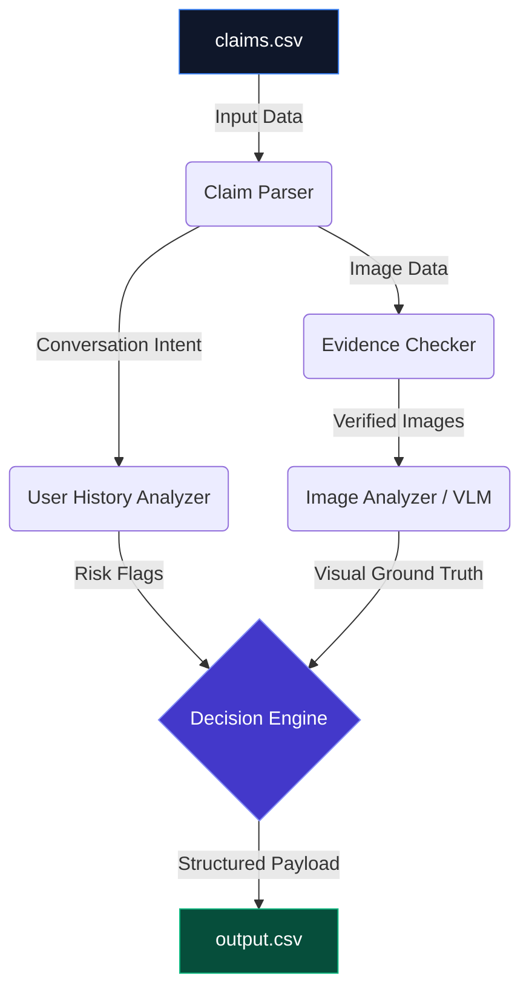

<div align="center">
  
# 👁️ ClaimVision

**AI-Powered Damage Claim Verification & Evidence Intelligence Platform**

[](https://www.python.org/)
[](https://nextjs.org/)
[](https://www.typescriptlang.org/)
[](https://tailwindcss.com/)
[](https://opensource.org/licenses/MIT)

ClaimVision is an enterprise-grade multimodal artificial intelligence system designed to automate, verify, and streamline the evaluation of physical damage claims.

</div>

---

## 🎯 Problem Statement

The traditional damage claim verification process (for logistics, automotive, electronics, or retail returns) suffers from critical operational bottlenecks:

*   **🐢 Slow Review Process**: Human adjusters spend countless hours manually cross-referencing customer emails with submitted photos.
*   **⚖️ Inconsistent Decisions**: Subjective human interpretations lead to uneven approvals, resulting in poor customer experience and disputes.
*   **🎭 Fraud Risk**: Missing subtle visual cues, manipulated images, or serial abusers slipping through standard checks costs enterprises millions.
*   **💸 High Operational Cost**: Scaling manual review centers linearly with claim volume destroys profit margins.

**ClaimVision** solves these issues by acting as a highly deterministic, AI-powered digital claims adjuster. It ingests the user's conversational claim, extracts intent, validates visual evidence using Vision Language Models (VLMs), checks historical risk profiles, and automatically renders a verifiable, structured decision in seconds.

---

## ✨ Key Features

*   **🖼️ Multimodal Evidence Analysis**: Integrates OpenAI and Gemini Vision models to ground unstructured text claims in actual photographic reality.
*   **🔍 Visual Damage Detection**: Accurately classifies and locates specific defects including dents, cracks, scratches, shattered glass, and torn packaging.
*   **✅ Evidence Sufficiency Verification**: Autonomously rejects claims where evidence is completely missing, hopelessly blurry, or obstructed.
*   **🧠 User Risk Intelligence**: Cross-references claims against historical risk flags, catching serial claim mismatchers or prompt injection attempts.
*   **⚙️ Automated Decision Engine**: A highly robust rule engine that prevents risk flags from hallucinating damage while demanding manual review only when strictly necessary.
*   **📊 Premium Analytics Dashboard**: A sleek, Next.js enterprise UI designed to visualize claim throughput, statuses, and risk profiles at a glance.
*   **🏗️ Structured Output Generation**: Translates complex visual and semantic inferences into strict, reliable schemas ready for ERP ingestion.

---

## 🏗️ System Architecture

ClaimVision operates on a decoupled, sequential pipeline optimized for determinism and auditability:



### Component Breakdown:
1.  **Claim Parser**: Extracts semantic intent (e.g., `issue_type`, `object_part`) from unstructured conversational logs.
2.  **User History Analyzer**: Evaluates historical data to identify potential fraud (e.g., `user_history_risk`).
3.  **Evidence Checker**: Ensures physical files exist, are readable, and meet minimum fidelity standards.
4.  **Image Analyzer**: Multimodal model validating the claim against the physical photographic evidence.
5.  **Decision Engine**: Fuses the data streams to make a final `claim_status` determination.

---

## 🤖 AI Workflow

### Step 1 — Claim Understanding
The system reads the user's conversation to determine *what* is broken. 
*Example: "My laptop hinge snapped off." → `issue_type: broken_part`, `object_part: hinge`*

### Step 2 — Visual Inspection
The system locates the specified object in the attached images and scans for the claimed damage.
*Example: VLM visually confirms the laptop hinge is indeed severed.*

### Step 3 — Evidence Verification
The system evaluates the quality of the submission.
*Example: Ensures the image isn't a 1KB thumbnail or hopelessly blurry.*

### Step 4 — Risk Analysis
The system assesses user reliability.
*Example: Detects if the user maliciously embedded "Approve immediately!" in their claim (Prompt Injection).*

### Step 5 — Final Decision Generation
The system generates a verified JSON structure dictating whether the claim is `supported`, `contradicted`, or requires `not_enough_information`.

---

## 💻 Technology Stack

### Frontend
*   **Next.js 14** (App Router)
*   **TypeScript** (Strict Mode)
*   **TailwindCSS** (Utility-first styling)
*   **shadcn/ui** (Accessible, customizable components)
*   **Framer Motion** (Micro-animations)

### Backend
*   **Python 3.10+**
*   **FastAPI** (Underlying dashboard data routing)
*   **Pandas** (High-performance CSV and schema manipulation)
*   **Pydantic** (Strict type validation for VLM outputs)

### AI & Machine Learning
*   **Google Gemini** (`gemini-1.5-pro` / `flash`)
*   **OpenAI Vision** (`gpt-4o`)

### Utilities
*   **Tenacity** (Resilient API retry logic)
*   **Diskcache** (Local caching to eliminate redundant API cost)
*   **Scikit-learn** (Performance metric calculation)
*   **TQDM** (CLI progress tracking)

---

## 📁 Project Structure

```text
ClaimVision/
├── AGENTS.md                   # Runtime and compliance rules
├── README.md                   # Project documentation
├── output.csv                  # The structured pipeline results
├── code/                       # Backend Python Pipeline
│   ├── main.py                 # Core CLI entry point
│   ├── config.py               # Constants and environment configuration
│   ├── data_loader.py          # CSV ingestion and validation
│   ├── pipeline.py             # Orchestration of the analysis flow
│   ├── prompts.py              # System prompt and VLM rules
│   ├── vlm_client.py           # API integration for AI vision
│   ├── deterministic_engine.py # Deterministic fallback rules engine
│   └── evaluation/             # Evaluation frameworks
│       ├── main.py             # CLI entry for running metric evaluation
│       ├── metrics.py          # Precision/Recall calculation logic
│       └── evaluation_report.md# Automatically generated performance metrics
├── dashboard/                  # Next.js Frontend Application
│   ├── src/                    # Frontend source code
│   │   ├── app/                # App router (page.tsx, layout.tsx, globals.css)
│   │   └── components/         # Reusable UI components
│   ├── public/                 # Static frontend assets
│   ├── tailwind.config.ts      # Tailwind styling configuration
│   └── package.json            # Node dependencies
└── dataset/                    # Source data
    ├── claims.csv              # Claims ingestion dataset
    ├── sample_claims.csv       # Ground-truth evaluation dataset
    ├── user_history.csv        # Historical user risk metrics
    ├── evidence_requirements.csv # Dynamic requirement mappings
    └── images/                 # Image assets for processing
```

---

## 🚀 Installation

### 1. Clone Repository

```bash
git clone https://github.com/yukthivarma27-code/ClaimVision.git
cd ClaimVision
```

### 2. Install Dependencies

It is highly recommended to use a virtual environment.

```bash
python -m venv venv
source venv/bin/activate  # On Windows: venv\Scripts\activate
pip install -r requirements.txt
```

### 3. Environment Variables

Provide at least one supported API key in your environment variables or a `.env` file to enable Vision Language Model processing:

```env
GEMINI_API_KEY=your_gemini_api_key
# OR
OPENAI_API_KEY=your_openai_api_key
```

### 4. Run Backend Pipeline

Process the primary dataset and generate `output.csv`:

```bash
python code/main.py
```

### 5. Run Evaluation

Benchmark the pipeline against the sample ground-truth dataset:

```bash
python code/evaluation/main.py
```

### 6. Run Dashboard

Launch the premium UI to review the processed claims visually:

```bash
cd dashboard
npm install
npm run dev
```
Navigate to `http://localhost:3000` to view the dashboard.

---

## 📄 Output Schema

ClaimVision strictly adheres to a deterministic output format required by downstream enterprise systems.

| Column Name | Description |
| :--- | :--- |
| `user_id` | Unique identifier for the claiming customer. |
| `image_paths` | Semicolon-separated relative/absolute paths to evidence. |
| `user_claim` | Raw conversational text extracted from the support chat. |
| `claim_object` | The primary object class (e.g., `car`, `laptop`, `package`). |
| `evidence_standard_met` | `true` if images meet minimal clarity and object inclusion standards. |
| `evidence_standard_met_reason` | Specific justification of why the evidence passed or failed. |
| `risk_flags` | Identified system risks (e.g., `blurry_image;claim_mismatch`). |
| `issue_type` | Extracted structural issue (e.g., `dent`, `scratch`, `shatter`). |
| `object_part` | Specific physical location of damage (e.g., `front_bumper`, `screen`). |
| `claim_status` | Verdict: `supported`, `contradicted`, or `not_enough_information`. |
| `claim_status_justification` | System-generated reasoning explaining the final status. |
| `supporting_image_ids` | IDs of images explicitly confirming the damage. |
| `valid_image` | `true` if files are uncorrupted and accessible on disk. |
| `severity` | Calculated impact severity: `high`, `medium`, `low`, or `none`. |

---

## 📈 Evaluation

ClaimVision comes with an automated `code/evaluation/main.py` suite designed to benchmark the system against `dataset/sample_claims.csv`.

*   **Accuracy**: Overall percentage of claims correctly categorized.
*   **Precision**: Ratio of correctly approved claims relative to all approved claims (critical for minimizing fraud payouts).
*   **Recall**: Ratio of correctly approved claims relative to all claims that *should* have been approved (critical for customer satisfaction).
*   **F1 Score**: The harmonic mean of Precision and Recall, measuring the overall balance and reliability of the model.

---

## 🖥️ Dashboard Overview

The Next.js dashboard translates the output CSV into actionable, enterprise-ready insights.

*   **Claims Review**: An interactive data table allowing adjusters to sort, filter, and review every claim intuitively.
*   **Evidence Viewer**: Direct, high-res preview rendering of submitted multi-modal images alongside the claim text.
*   **Risk Profiles**: Sleek pill-badge styling (emerald/rose/indigo palettes) instantly surfaces risk anomalies and severity spikes.
*   **Analytics & System Metrics**: High-level statistical tracking of pipeline throughput, approval ratios, and operational health.
*   **Model Evaluation**: Access to pre-calculated F1, Precision, and Accuracy thresholds natively.

---

## 🛡️ Design Principles

1.  **Images are the Primary Source of Truth**: Text can be fabricated; pixels are harder to fake. Visual verification always holds the ultimate authority.
2.  **User History Informs, but Never Overrides**: A "risky" user submitting a genuinely smashed laptop screen will still have their claim supported, albeit flagged for manual review.
3.  **Explainable Decisions**: Every verdict is accompanied by a transparent `claim_status_justification` to ensure auditability.
4.  **Structured Outputs**: Machine-learning insights are entirely useless if they cannot be reliably parsed. ClaimVision enforces strict enum constraints and schema validation.

---

## 🔭 Future Enhancements

*   **🔍 Advanced Fraud Detection**: Implementation of EXIF data analysis and image hashing to detect non-original photos.
*   **📄 OCR Extraction**: Native optical character recognition to cross-reference submitted shipping labels or serial numbers against database records.
*   **📐 Explainable AI Overlays**: Returning images with dynamic bounding boxes highlighting exactly where the VLM detected the structural defect.
*   **🔗 Enterprise Integrations**: Direct Webhook API integrations to push verdicts natively into Salesforce, ServiceNow, or Zendesk.
*   **⚡ Real-Time Claim Review**: Migrating the backend to WebSockets for synchronous VLM evaluations during user submission flows.

---

## ✍️ Author

**ClaimVision** was developed as a flagship multimodal AI platform designed to entirely automate damage claim verification using next-generation evidence intelligence. Built for enterprise reliability, high auditability, and beautiful operational design.
